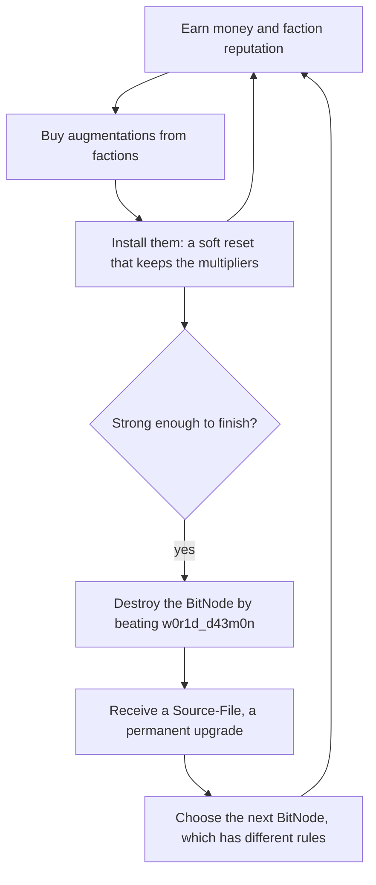
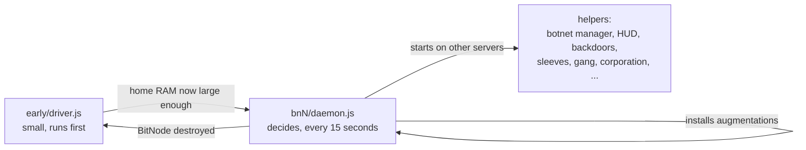
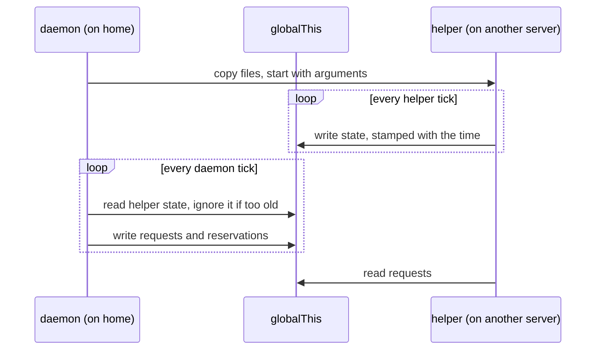

# A newcomer's guide to this repo

This guide is for someone who has just started Bitburner, can read JavaScript, and has cloned
this repository. It explains the game far enough to make the code readable, shows how to get
the scripts running, walks through one whole run in the order you will see it, and then
explains the handful of ideas the code is built on.

The [README](../README.md) is the reference for someone who already knows both the game and
the code. This guide is the on-ramp to it. Where the README has the detail, this guide links
to the section instead of repeating it.

Game facts here were checked against the game's own documentation and source for v3.0.2
([documentation index](https://github.com/bitburner-official/bitburner-src/blob/dev/src/Documentation/doc/en/index.md),
[`BitNode.tsx`](https://github.com/bitburner-official/bitburner-src/blob/dev/src/BitNode/BitNode.tsx)).
Facts about the scripts were read from the code. Where something could not be verified, the
text says so.

## Contents

1. [The game in ten minutes](#1-the-game-in-ten-minutes)
2. [What the bot needs before it will run](#2-what-the-bot-needs-before-it-will-run)
3. [Getting the scripts into the game and starting them](#3-getting-the-scripts-into-the-game-and-starting-them)
4. [What happens after you press Enter](#4-what-happens-after-you-press-enter)
5. [The big ideas, from scratch](#5-the-big-ideas-from-scratch)
6. [A map of the repo](#6-a-map-of-the-repo)
7. [Each BitNode in brief](#7-each-bitnode-in-brief)
8. [When something looks wrong](#8-when-something-looks-wrong)
9. [Glossary](#9-glossary)
10. [Where next](#10-where-next)

---

## 1. The game in ten minutes

### What you are trying to do

Bitburner is a game about writing real JavaScript that plays the game for you. Underneath the
story, the loop is this:



An **augmentation** ("aug") is a permanent multiplier on something: hacking skill, money
stolen, reputation gained, and so on. A **faction** is a group that sells augmentations once
you have earned enough **reputation** with it. Buying an aug does nothing until you **install**
it, and installing resets most of your progress. Each pass through that inner loop leaves you
with better multipliers, so the next pass is faster.

A **BitNode** is one complete copy of the game world with its own rule changes. You start in
BitNode 1. Destroying a BitNode awards its **Source-File**, an upgrade that survives
everything, and then you pick the next BitNode. There are fifteen.

### Servers, RAM and threads

The world is a network of **servers**. One of them, `home`, is yours. Every server has some
**RAM**, and a script needs RAM to run. You can run scripts on any server you have **root
access** to. You get root by running `NUKE.exe` against a server after opening enough of its
ports, and you open ports with five **port-opener programs** (`BruteSSH.exe` and four others)
that you create or buy. Each server also requires a minimum **hacking level**, a skill of
yours that rises as you hack and study, before you can hack it.

A script can be started with several **threads**. Threads multiply the script's RAM cost and
also multiply the effect of `hack`, `grow` and `weaken`. Ten threads of a hack script steal
ten times as much and cost ten times the RAM.

That makes RAM the central resource of the whole game. Income is proportional to how many
threads you can run, and threads are RAM. You get more RAM three ways: upgrading `home`,
rooting more of the network, and buying **cloud servers** (the game's term; the code and older
guides also say "purchased servers"). Cloud servers are cheaper per gigabyte than home
upgrades but are lost on every install.

### Hack, grow, weaken and security

Most servers hold money. Three functions act on a server:

| Function | What it does | Side effect |
| --- | --- | --- |
| `ns.hack(target)` | Steals a percentage of the money currently on the server | Raises the server's security |
| `ns.grow(target)` | Multiplies the money on the server back up | Raises the server's security |
| `ns.weaken(target)` | Lowers the server's security | None |

**Security** is a number on each server. Higher security makes every action against that
server take longer, makes hacks fail more often and makes each hack steal less. Each server
has a minimum security it cannot be weakened below, and a maximum amount of money it cannot be
grown above. A server sitting at minimum security and maximum money is the best possible
state to hack it in. The scripts call that state **prepped**.

In the game's source, a grow takes 3.2 times as long as a hack on the same server and a
weaken takes 4 times as long. Section 5 shows why those ratios matter.

### Why scripts have a static RAM cost

The game does not measure how much memory your script uses. It reads the source code, finds
every `ns.` function the script could call (including in files it imports), and adds up a
fixed price per function. A script costs 1.6GB before it calls anything; `ns.hack` adds
0.1GB; some functions cost far more. The call that ends a BitNode,
`ns.singularity.destroyW0r1dD43m0n`, costs 32GB on its own.

The price is charged whether or not the call ever executes. A script that mentions one
expensive function once, in a branch that runs once a week, pays for it all the time. Almost
every structural decision in this repo follows from that rule. Section 5 explains how.

### What survives a reset

There are two kinds of reset, and it helps to keep them apart.

| | Installing augmentations | Destroying a BitNode |
| --- | --- | --- |
| Installed augmentations | Kept | Lost |
| Source-Files | Kept | Kept, and one gained |
| Scripts on `home` | Kept | Kept |
| Home RAM and cores | Kept | Lost |
| Money, skills and stats | Lost | Lost |
| Cloud servers, programs, the TOR router (explained below) | Lost | Lost |
| Hacknet nodes (explained below) | Lost | Lost |
| Faction memberships and reputation | Lost, but reputation converts to favor | Lost |
| Stock positions | Lost | Lost |
| Intelligence (a late stat) | Kept | Kept |

Some of the side mechanics below have their own rules. According to the game's
documentation, a gang and its members survive an install, Bladeburner rank and skill points
survive an install, and sleeves survive an install but are reset by a BitNode change. The
code in this repo also relies on a corporation and your karma surviving an install, and on
IPvGO bonuses and hacknet servers not surviving one.

**Favor** is what makes repeated installs worthwhile for reputation. When you install, the
reputation you held with each faction turns into favor with it, and favor speeds up
reputation gain there on later runs. At a threshold of favor (150 in the base game, scaled by
a BitNode multiplier) the faction starts accepting **donations**, which means reputation can
be bought with money.

### The side mechanics

Each of these is a separate system with its own API. A new player meets them one BitNode at a
time. "Unlocked by" means the BitNode in which it is available; owning that BitNode's
Source-File makes it available everywhere.

| Mechanic | What it is | Why you would want it | Unlocked by |
| --- | --- | --- | --- |
| Factions and favor | Groups you join by meeting requirements; you work for them to earn reputation | The only source of augmentations | Base game |
| Companies | Jobs that pay a salary and company reputation | Early money; enough reputation at the largest companies opens their factions | Base game |
| Crime and karma | Timed actions that pay money and experience and lower your **karma** | Early money and **combat stats** (strength, defense, dexterity, agility); low karma is a requirement for some factions and for gangs | Base game |
| Hacknet nodes | Machines you buy that earn money passively | A small early income; the game's docs say they are not enough to progress alone | Base game |
| Coding contracts | `.cct` puzzle files that appear on servers and pay a reward when solved | Free rewards for a correct answer; attempts are limited | Base game |
| Stock market | Buy and sell stocks; forecasts decide whether a stock tends to rise | Income that does not depend on hacking | Base game (a market account and an API are bought with money); BitNode 8 makes it the only income |
| Infiltration | A keyboard minigame played at a company | Money or faction reputation | Base game. This repo does not automate it |
| IPvGO | A game of Go against a faction's AI | Each game adds "node power", which multiplies one stat depending on the opponent | Base game. BitNode 14 makes the bonuses four times larger |
| Singularity | An API that lets scripts do what the player does by hand: work, study, travel, buy and install augmentations | Full automation. Without it a script cannot buy an aug | BitNode 4 |
| Gangs | A crew you recruit, train and send on tasks | Money, and the gang's faction offers more augmentations than other factions, with its reputation coming from the gang's "respect" instead of your own work | BitNode 2. Elsewhere it also needs karma of -54,000 or lower |
| Corporations | A business simulation: divisions, products, investors | Very large late income | BitNode 3 |
| Intelligence | A stat that never resets and boosts many actions slightly | Permanent, slow-growing bonus | Source-File 5 |
| Bladeburner | A combat career: contracts, operations and a chain of "black ops" | A second way to destroy a BitNode, without the hacking requirement | BitNodes 6 and 7 |
| Hacknet servers and hashes | An upgrade to hacknet nodes that produce **hashes** instead of money | Hashes are spent on upgrades or sold for money | BitNode 9 |
| Sleeves | Copies of you that perform work-type actions in parallel | Several extra work slots | BitNode 10 |
| Grafting | Paying money and time to gain an augmentation without installing | Augs with no reset; each graft adds a permanent penalty called Entropy | BitNode 10 |
| Stanek's Gift | A grid you fill with fragments that each boost a multiplier; scripts "charge" them | A large tunable bonus | BitNode 13 |
| The dark net | A separate, shifting network of servers with its own API, entered with `DarkscapeNavigator.exe` | Money, caches, and in BitNode 15 a route to the finishing augmentation | The game's BitNode 15 is built around it. This repo does not automate it |

Two more terms come up constantly. The **dark web** (not the dark net) is a shop reached by
buying a TOR router; it sells the port-opener programs. **`Formulas.exe`** is a program that
unlocks exact formula functions for scripts; Source-File 5 gives it to you permanently.

### How a BitNode ends

The ordinary route is: join the faction Daedalus, earn enough reputation to buy an
augmentation called **The Red Pill**, install it, and then beat a server called
`w0r1d_d43m0n`, which needs a hacking level of 3000 multiplied by the BitNode's difficulty
setting. The second route, available where Bladeburner is, is to complete every black op; the
last one is Operation Daedalus.

---

## 2. What the bot needs before it will run

Read this before syncing anything, because it decides whether these scripts are usable for
you yet.

**The bot needs the Singularity API.** Nearly everything a daemon does (working for factions,
buying augmentations, installing them, upgrading home RAM, ending the BitNode) is a
Singularity call. Singularity is available in BitNode 4, or anywhere once you own
Source-File 4. The game charges extra RAM for Singularity calls outside BitNode 4 until that
Source-File is at level 3: sixteen times the normal cost at level 1, four times at level 2,
normal cost at level 3. [`lib/capabilities.js`](../lib/capabilities.js) encodes that table
and `run tools/self-test.js` prints the multiplier you currently have.

The scripts were written by a player who already owns several Source-Files, including
Source-File 4 at level 3. The BitNode 1 daemon ([`bn1/daemon.js`](../bn1/daemon.js)) is the
same plain loop as BitNode 4's, so it needs Singularity like every other daemon - a first-ever
BitNode 1, with no Source-Files, cannot run it.

**Home RAM matters too.** A new BitNode starts you with 8GB of home RAM, 32GB once you own
Source-File 1, and 128GB with Source-File 9 at level 2. The driver's own header assumes 32GB.
Counting the API calls it reaches gives roughly 12 to 13GB at normal Singularity cost, so on
a bare 8GB home it probably will not start. That figure was counted by hand, not measured;
`mem early/driver.js` in the game's terminal prints the real one.

So, for a player with no Source-Files at all:

- Play BitNode 1 with the game's own
  [Beginner's guide](https://github.com/bitburner-official/bitburner-src/blob/dev/src/Documentation/doc/en/help/getting_started.md).
  Sections 1 and 5 of this guide will make more sense as you go.
- Parts of this repo do not use Singularity and can be run by hand in the meantime.
  [`early/worker.js`](../early/worker.js) is a simple weaken/grow/hack loop of about 2.5GB per
  thread that takes a target as its argument. [`hacking/manager.js`](../hacking/manager.js),
  the batching botnet described below, roots servers itself and runs standalone; its header
  puts it at about 12GB. Neither has been tested in BitNode 1 for this guide.
- Which BitNode to do next, and why, is covered in [ACHIEVEMENTS.md](ACHIEVEMENTS.md).

Everything from here on assumes Singularity is available.

---

## 3. Getting the scripts into the game and starting them

### Step 1: sync the files

The game does not read your disk. Files reach it through its **Remote API**: you run a small
server program on your machine, and the game connects to it and accepts files from it.

The repo includes one such program, [`BitburnerGoFilesync.exe`](../BitburnerGoFilesync.exe),
a Windows build of the community tool
[BitburnerGoFilesync](https://github.com/CTNOriginals/BitburnerGoFilesync), which the game's
[Remote API page](https://github.com/bitburner-official/bitburner-src/blob/dev/src/Documentation/doc/en/programming/remote_api.md)
lists. The README does not describe this step, and the repo has no configuration file for the
tool, so what follows is the general Remote API procedure plus what the tool's built-in help
text says:

1. Start the tool from the repository root. It watches the folder and pushes a file whenever
   one is created, changed or deleted.
2. In the game, open **Options, then Remote API**. Enter the hostname (`localhost`) and the
   tool's port, then press **Connect**. The tool's help text gives its default as
   `localhost:8080` and names `--port` and `--dir` options; `BitburnerGoFilesync.exe --help`
   lists the rest.
3. The connection drops when the machine sleeps. Reconnect from the same options page.

Any other Remote API tool works as well. What matters is the result: the files must land on
`home` with the same folder layout as the repo (`/early/driver.js`, `/lib/config.js`, and so
on), because scripts import each other by relative path and
[`lib/config.js`](../lib/config.js) names scripts by absolute path.

There is no build step. The `.js` files run in the game as they are. The other project files
exist only for your editor and for tests:

- [`jsconfig.json`](../jsconfig.json) and [`types/`](../types) turn on type checking in an
  editor such as VS Code. `types/NetscriptDefinitions.d.ts` is the game's API typings, and
  `types/global.d.ts` makes the `NS` type available to every file's JSDoc comments.
- [`package.json`](../package.json) defines one command, `npm test`. It has no dependencies.

### Step 2: check the sync landed

In the game's terminal:

```text
run tools/self-test.js
```

[`tools/self-test.js`](../tools/self-test.js) buys nothing and resets nothing. It checks that
every script named in the config exists, asks the game for the RAM cost of every `.js` file on
`home` (a file with a syntax error or a broken import reports 0 and is listed as `BROKEN`),
prints a character count of the source so you can tell a stale copy from a fresh one, prints
each script's RAM cost, says whether the current BitNode's daemon already fits in home RAM,
and lists which gated APIs you have. It ends with `RESULT: OK` or `RESULT: FAIL`. See the
README's [Self-test](../README.md#self-test) section.

### Step 3: start everything

```text
killall; run /early/driver.js
```

That one line is both the first start and the restart. `killall` stops every script on
`home`; the driver then brings the rest up. You do not start anything else by hand.

**Scripts do not hot-reload.** A running script keeps the code it started with, so syncing a
change does nothing to processes that are already running. After a sync, run the line above
again. If the change was to a helper (anything the daemon places on another server, which is
most of `lib/`), stop the helpers first, because `killall` only reaches `home`:

```text
run /tools/kill-helpers.js all
killall; run /early/driver.js
```

### The tools

| Command | What it tells you or does |
| --- | --- |
| `run tools/self-test.js` | Pre-flight check after a sync, described above |
| `run tools/hack-status.js` | Whether the botnet manager is running, whether anything has room to start it, what the running workers are targeting, and the target table it would rank. Add a number to rank more targets |
| `run tools/kill-helpers.js` | Stops the helpers that can end a BitNode (`lib/backdoor.js`, `lib/finish-bn.js`, `lib/bladeburner.js`) on every server |
| `run tools/kill-helpers.js all` | Stops every helper the daemon can place off `home`. The daemon relaunches what it needs on its next tick |
| `run tools/corp-status.js` | What the corporation owns, what it can afford and what it is blocked on. It uses the corporation API, so it needs a lot of RAM |
| `run tools/exploits.js` | Earns the developers' hidden "exploits" (Source-File -1); see [ACHIEVEMENTS.md](ACHIEVEMENTS.md) |
| `run tools/debt.js` | Dry run of the "$1b in debt" achievement; does nothing without `--go` |

The first four are read-only except `kill-helpers.js`, which only kills scripts. The last two
change things on purpose; read ACHIEVEMENTS.md before running them. The `offline/` folder holds
two more tools that are not game scripts at all: they run under Node and read save files.

### Running the tests

The decision-making code is written as pure functions that do not touch the game, so it can
be tested outside it. With Node 20 or newer installed (`.nvmrc` pins 22):

```bash
npm test
```

This runs `node --test tests/*.test.mjs`. Node is used for nothing else. The tests were not
run while writing this guide. See the README's [Testing](../README.md#testing) section.

---

## 4. What happens after you press Enter

This is one whole run, in the order you will see it. Each stage names the file responsible
and the one idea that makes it work. Two words first:

- A **daemon** here is the long-running script that makes the decisions for one BitNode. There
  is one per BitNode, at `bnN/daemon.js`.
- A **helper** is a smaller script the daemon starts on some other server to do one job.



### Stage 1: the cold start

**What you see.** The terminal prints `Bootstrap started (BitNode N) -> target daemon
/bnN/daemon.js`. There is no HUD yet. The driver's log window, if you open it, prints a line
every 15 seconds: home RAM, the RAM it is waiting for, free RAM and money.

**Responsible.** [`early/driver.js`](../early/driver.js).

**The idea.** The daemon is too big to fit in a fresh home computer, so a small script runs
first whose only job is to earn enough to make room for it. Each loop it makes sure a money
engine is running, buys every home RAM upgrade it can afford, and checks whether home is now large
enough for the daemon plus 8GB of headroom. When it is, the driver stops the money engine,
starts the daemon and exits.

The driver deliberately imports very little, because every import adds to its RAM cost. It
imports the config, which costs nothing, and avoids the modules full of Singularity calls.

In some BitNodes the driver starts one more thing during this phase so the node's main engine
is not idle while home grows: the hacknet manager in BitNode 9, a gang bootstrap in BitNode 2,
a script that trains for and joins the Bladeburner division where that is the plan, and a
short script that accepts Stanek's Gift where it is available.

### Stage 2: the botnet takes over the network

**What you see.** The Active Scripts page fills with `hack.js`, `grow.js` and `weaken.js`
processes on every server you have root on. `run tools/hack-status.js` shows what is being
targeted.

**Responsible.** [`hacking/manager.js`](../hacking/manager.js), with every calculation in
[`lib/batch-logic.js`](../lib/batch-logic.js). If the manager file is missing, the driver
falls back to spraying [`early/worker.js`](../early/worker.js) across the network.

**The idea.** The manager treats all rooted servers as one pool of RAM (the **botnet**). It
first **preps** a target to minimum security and maximum money, then fires **batches**: four
small scripts timed so that the server is hacked and repaired within about a second, over and
over. Section 5 explains batching. With a lot of RAM it works several targets at once and
splits the RAM between them.

### Stage 3: the daemon starts and the HUD appears

**What you see.** The terminal prints `Home RAM ... >= ... needed. Started /bnN/daemon.js`. A
window titled **GORDNET** opens. That is the HUD, drawn by
[`ui/dashboard.js`](../ui/dashboard.js).

**Responsible.** The node's `bnN/daemon.js`, which is a thin file on top of
[`lib/daemon-core.js`](../lib/daemon-core.js) (the loop) and
[`lib/daemon-lib.js`](../lib/daemon-lib.js) (the building blocks).

**The idea.** One loop, every 15 seconds, does the same things in the same order: accept
faction invitations, buy the TOR router and programs when affordable, root everything
rootable, make sure each helper is running somewhere, decide what the player should be doing,
buy any augmentation that is ready, and check whether it is time to install.

The HUD's header shows the BitNode, the time since the last install, a clock, and three
switches described in [section 8](#8-when-something-looks-wrong). If the daemon has not
reported for a minute it shows `DAEMON DOWN` in red. Below the header are nine tabs:

| Tab | What it shows | Shows only a one-line placeholder unless |
| --- | --- | --- |
| STATS | Cards: CURRENT RUN, OVERALL (Source-Files and other things that persist), PLAYER, GOAL, INFRA / AUGS, NETWORK, PIPELINE, STOCKS, BOTNET, CONTRACTS | Always populated |
| JOURNAL | A plain-language log of what the bot is doing and why, plus milestone lines | Always populated |
| GANG | The gang, or progress toward the karma needed to found one | A gang exists, or a daemon is tracking the karma grind |
| CORP | The corporation | The node runs one |
| SLEEVE | The sleeve roster and what each sleeve is doing; a grafting card when a graft manager is running | `lib/sleeves.js` or `lib/grafting.js` is running |
| HACKNET | The hacknet-server fleet and what the hashes are being spent on | `lib/hacknet.js` is running |
| BLADE | Bladeburner rank, the next black op, skills | `lib/bladeburner.js` is running |
| GO | The IPvGO game in progress and the bonuses earned | `lib/go.js` found a server to run on |
| STANEK | The Gift's layout and each fragment's charge | `lib/stanek.js` is running |

If you only watch one thing, watch the JOURNAL tab. It adds a line when the bot's intention
changes, not on every tick.

### Stage 4: the early bootstrap and the first cloud servers

**What you see.** The GOAL card and the journal say `Studying`, then `Training`, then `Crime`
(mugging). Servers named `cloud-0`, `cloud-1` and so on begin to appear.

**Responsible.** `doEarlyBootstrapIfNeeded` in
[`lib/player-actions.js`](../lib/player-actions.js) for the player;
[`lib/pserv.js`](../lib/pserv.js) for the servers.

**The idea.** Right after any reset you have no programs and almost no skills. The bot
studies to hacking level 50, trains at the gym until mugging succeeds three times in four,
then mugs until it can pay for the TOR router and `BruteSSH.exe`. Each port opener it gains
lets it root more servers, which is more RAM for the botnet.

Cloud servers are bought with a slice of spare cash, never all of it, because cash also buys
augmentations. The slice shrinks when the bot is close to affording an aug. Each purchase is
whichever option gives the most RAM per dollar.

### Stage 5: the node's own engine and the helpers

**What you see.** New tabs fill in. On the Active Scripts page, helper scripts appear on
servers other than `home`: `lib/backdoor.js`, `lib/sleeves.js`, `lib/gang.js`, and so on. The
journal reports factions joined and backdoors installed.

**Responsible.** `runDaemon` in [`lib/daemon-core.js`](../lib/daemon-core.js), which calls
`ensureHelper` in [`lib/daemon-lib.js`](../lib/daemon-lib.js) for each helper in a fixed
order.

**The idea.** The order of the launches is the priority order for scarce RAM. The backdoor
helper goes first because installing backdoors on four particular servers is what unlocks the
hacking factions. The node's own engine comes next when it is a helper (the Bladeburner loop,
or the stock trader in BitNode 8). Then the sleeve manager, the gang and corporation managers
on dedicated servers named `cloud-gang` and `cloud-corp`, and last the botnet manager, the
HUD and the optional scripts: the stock trader, the contract solver, the IPvGO player.

A helper marked optional waits quietly until some server has room. A required one that cannot
be placed writes a warning line to the journal.

### Stage 6: faction work and the augmentation pipeline

**What you see.** The GOAL card names an augmentation and a faction, with bars for reputation
and price. The PIPELINE card lists the next candidates in order. The journal says things like
`Faction Rep`, `Saving`, `Ready to Purchase`.

**Responsible.** [`lib/aug-targets.js`](../lib/aug-targets.js) picks the target using the
scoring in [`lib/aug-value.js`](../lib/aug-value.js). `decideAugFlow` in
[`lib/daemon-core.js`](../lib/daemon-core.js) turns the target into an action. `buyAugs` in
[`lib/daemon-lib.js`](../lib/daemon-lib.js) does the buying.

**The idea.** You can do one thing at a time yourself (the code calls this the **work slot**),
so the question every tick is what the slot is worth most on. The answer is a short chain:
train combat stats if the target faction requires them, otherwise work for the faction until
the reputation is there, otherwise earn the money, otherwise buy. The botnet earns money in
the background the whole time, which is why the slot usually goes to reputation.

While the slot is on faction work, the botnet manager also lends a small part of its RAM to
`ns.share()`, a function that speeds up worked reputation.

### Stage 7: the install

**What you see.** The terminal may print why (for example `Aggressive install: ...`). Then the
game's install screen, and the run starts again with the daemon already running and the
player back at the early bootstrap of stage 4. The journal reports once what was installed.

**Responsible.** `installReason` and `maybeInstall` in
[`lib/daemon-lib.js`](../lib/daemon-lib.js).

**The idea.** An install throws away the current run, so it has to be worth it. The rule is a
short list of triggers, read from the node's config, and section 5 lists them. Before
resetting, the daemon asks the stock trader to sell everything (positions do not survive),
gives the node a chance to do the same for anything else that would be lost, and spends
whatever cash is left on levels of **NeuroFlux Governor**, the one augmentation that can be
bought repeatedly, because money does not survive either.

The install restarts the node's daemon directly. The driver is not needed, because home RAM
survives an install.

### Stage 8: finishing the BitNode and moving to the next

**What you see.** After The Red Pill is installed and the hacking level is high enough, the
terminal prints `Destroying w0r1d_d43m0n. Next BitNode: N`. The game shows its BitNode
transition, and then you are back at stage 1 in the new node. If the finish is being held, the
terminal says so and says why.

**Responsible.** [`lib/backdoor.js`](../lib/backdoor.js) reports when the world daemon is
ready. [`lib/finish-bn.js`](../lib/finish-bn.js) makes the call that ends the node.
`plannedNextNode` in [`lib/daemon-lib.js`](../lib/daemon-lib.js) and `campaignStep` in
[`lib/capabilities.js`](../lib/capabilities.js) choose where to go.

**The idea.** Ending a BitNode cannot be undone, so three things must all agree: the world
daemon is ready, the HUD's FINISH switch is on, and there is a next BitNode to go to. The next
BitNode comes from the **campaign plan**, `campaign.order` in
[`lib/config.js`](../lib/config.js), a list of steps. A step is either
`[BitNode, Source-File level]` or `[BitNode, "challenge"]`. The bot enters the first step
that will still be unmet after the current run is counted. The list is long (it is the whole
route to every achievement, explained in [ACHIEVEMENTS.md](ACHIEVEMENTS.md)); it begins:

```js
order: [
  [7, 2],               // BitNode 7 until Source-File 7 is level 2
  [9, 3],               // then BitNode 9 until Source-File 9 is level 3
  [5, 3],               // then BitNode 5 until Source-File 5 is level 3
  [13, 1],              // then BitNode 13 once
  // ...
  [13, "challenge"],    // later: BitNode 13 once more, as its challenge run
],
```

A **challenge run** is a run of a BitNode played without that node's own mechanic, for the
achievement the game gives for it: BitNode 2 without a gang, BitNode 13 without Stanek's
Gift, and so on. The game lets you enter a node with options that switch a mechanic off, so
the bot enters with those options and uses a config to match (`CHALLENGE` in `lib/config.js`).
Whether a challenge has already been earned is not something scripts can ask the game, so a
small helper, [`lib/achievements.js`](../lib/achievements.js), reads the list of achievements
out of the save file, and the HUD's ACHIEVE tab shows it.

When every step is satisfied the plan returns 0, which every daemon reads as "do not finish;
the player chooses". You can override the plan for the rest of the current BitNode by passing
a number to the daemon, for example `run bn7/daemon.js 10`. `0` means hold, and `auto` forgets
the override.

In the new node the game runs a script of the bot's choosing. That script is always the
driver, because a fresh node is back to a small home computer and the driver is the only
thing that fits.

On the Bladeburner nodes the finish is different: the last black op, Operation Daedalus, ends
the node, and `lib/finish-bn.js` is started in a "blade" mode that skips the hacking checks.

---

## 5. The big ideas, from scratch

### HWGW batching

"HWGW" is the order four scripts land in: **H**ack, **W**eaken, **G**row, **W**eaken.

The naive way to earn is a loop: weaken until security is low, grow until money is high,
hack, repeat. It works, and `early/worker.js` does exactly that, but the server spends most
of its time not being hacked.

Batching rests on one fact about the game: an action's duration is fixed when it *starts*, but
its effect happens when it *finishes*. So you can start four actions at different moments and
have them all finish within a second of each other, in a chosen order:

1. The hack lands and steals money. Security goes up.
2. The first weaken lands and cancels the security the hack added.
3. The grow lands and restores the money. Security goes up again.
4. The second weaken lands and cancels the security the grow added.

The server is prepped before the batch and prepped again after it. Because of that, the next
batch can land a moment later and find the server exactly as planned.

A worked example, using the config's 200ms spacing and a server where a weaken takes 60
seconds (so a hack takes 15 and a grow takes 48):

```text
script     started at    lands at
weaken 1      0.0 s        60.0 s
weaken 2      0.6 s        60.6 s
grow         12.4 s        60.4 s
hack         44.6 s        59.6 s

landing order:  hack 59.6 -> weaken 60.0 -> grow 60.4 -> weaken 60.6
```

In practice the manager launches all four scripts of a batch together and passes each its
delay, which the game adds to the action's duration; "started at" in the table is that delay.
The scripts therefore hold their RAM from launch until they land.

The four landings span one second. The manager starts a new batch every 1.2 seconds (the span
plus a 200ms margin), so about fifty batches are in flight at once against this one server.

How big is a batch? The game's constants are: each hack thread adds 0.002 security, each grow
thread adds 0.004, and each weaken thread removes 0.05. Suppose one hack thread steals 0.5%
of the server's money, and suppose (this number is invented for the example) that 30 grow
threads undo a 10% theft:

```text
hack      20 threads   steals 10%, adds 0.04 security
weaken 1   1 thread    removes 0.05
grow      31 threads   30 plus 2% padding, adds 0.124 security
weaken 2   3 threads   removes 0.15
RAM: 20 x 1.7 + 31 x 1.75 + 4 x 1.75 = 95.25 GB per batch
```

Fifty of those in flight is nearly 5TB. That is why RAM is the constraint, and why the
manager's job is an allocation problem.

**Prep** is the one-off work of getting a target to minimum security and maximum money before
the first batch. **Security matters** because every duration in the table above was computed
for minimum security; if security is higher when a script starts, the script takes longer and
lands out of order. When the manager sees a target drift from the prepped state it stops
launching against it, lets the batches in flight land, and preps it again.

What the manager optimises:

- The timing fixes how many batches can be in flight. Given that, each batch is made as large
  as the RAM allows, up to stealing half the server's money (`hacking.maxHackFraction`).
- Larger bites are less efficient. Repairing a 50% theft takes far more than five times the
  grow threads of a 10% theft. So income per gigabyte falls as a batch gets fatter.
- Because of that, RAM is split between several targets so that the last gigabyte given to
  each earns about the same (`allocateRam`). A target that is already prepped gets a small
  preference over one that would first need prepping.

The README's [HGW batcher](../README.md#hgw-batcher) section has the full detail, including
why each rule exists.

### Static RAM and the off-home helper pattern

Recall that a script pays for every API function it could call, all the time. The daemon
lives on `home` and home RAM is precious. If the daemon contained the call that ends the
BitNode it would be 32GB larger for a call it makes once.

So expensive calls are moved into small separate scripts. The daemon copies the script to
whichever server has room and starts it there. Some helpers are loops that run for the whole
node (`lib/backdoor.js`, `lib/sleeves.js`); some are one-shots that do one thing and exit
(`lib/finish-bn.js`, `lib/aug-stats.js`). Some prices, for scale: every sleeve function costs
4GB, a corporation getter costs 10GB and a corporation action 20GB. The corporation manager
is split into several scripts for exactly this reason.

Helpers and the daemon need to talk, and they run on different servers. They use
`globalThis`, the JavaScript global object, which every script in the game shares regardless
of which server it runs on. Reading or writing it costs no RAM. Almost every shared key in
this repo starts with `gord`.



A few of the keys, to show the shape:

| Key | Written by | Read by | Meaning |
| --- | --- | --- | --- |
| `gordState` | the daemon | the HUD, the botnet manager | What the bot is doing now and its current aug target |
| `gordHackState` | `hacking/manager.js` | the HUD | The botnet's targets and status |
| `gordBackdoorState` | `lib/backdoor.js` | the daemon | Which backdoors are done; whether the world daemon is ready |
| `gordReservedHosts`, `gordReservedRam` | the daemon | the botnet manager, the server buyer | Servers, or amounts of RAM, to leave alone |
| `gordMoneyFloor` | whichever script is holding cash for something | every spender | Money that must not be spent |
| `gordEvents` | any script, through `lib/events.js` | the journal | Milestones to display |
| `gordAutoFocus`, `gordAutoFinish`, `gordCorpAuto` | the HUD's switches | the daemon | The three toggles |

Two cautions follow from this design. State in `globalThis` can outlive the script that wrote
it, so readers check its timestamp and the daemon deletes the keys that gate irreversible
decisions every time it starts. And a click handler in the HUD must not call any `ns`
function (the game stops the script if it does), so a click only assigns a `globalThis`
value, and the daemon acts on it on its next tick.

One related saving: splitting code into more *files* does not reduce RAM, because imports are
counted. Only moving a call into a separate *process* does.

### One config, with a per-BitNode overlay

Every tunable number is in [`lib/config.js`](../lib/config.js). The file makes no game calls,
so importing it costs nothing. It exports three things:

- `CONFIG`, the defaults.
- `BITNODE`, an object keyed by BitNode number that holds only what differs in that node.
- `forNode(n)`, which returns `CONFIG` with `BITNODE[n]` merged over it.

The merge is deep: an override of one nested key leaves its siblings alone. Arrays are the
exception and are replaced whole.

To change a setting for one node, add the key to that node's entry. For example, to make
BitNode 5 wait for eight queued augmentations before installing instead of five:

```js
export const BITNODE = {
  // ...
  5: {
    name: "Artificial Intelligence",
    paths: { daemon: "/bn5/daemon.js" },
    gang: { activeKarmaGrind: true },
    augs: { install: { queuedThreshold: 8 } },   // added
  },
```

There is one trap. An override only reaches code that reads the value through `forNode(n)`. A
module that saves `CONFIG.something` in a top-level constant keeps the default forever.
[`tests/config-captures.test.mjs`](../tests/config-captures.test.mjs) fails when a module does
that with a key some BitNode overrides. Helpers that need to know the node receive its number
as a launch argument and call `forNode` themselves.

To change where the bot goes after a BitNode, edit `campaign.order` in `CONFIG`. See the
README's [Configuration](../README.md#configuration) section.

### The augmentation pipeline

**Which augmentation to work toward.** The obvious rule, "whichever is closest", sends the bot
after cheap trinkets. This repo ranks by value per unit of time instead
([`lib/aug-value.js`](../lib/aug-value.js)).

An aug's value is a weighted sum of the logarithm of each multiplier it grants. The weights
are config and differ by node: hacking multipliers weigh most by default, combat and
Bladeburner multipliers on the Bladeburner nodes, hacknet multipliers in BitNode 9. Under the
default weights an aug that adds 10% to hacking level is worth about 0.1.

Reputation with a faction is cumulative, so reaching the reputation for one aug also unlocks
every cheaper aug that faction sells. Each candidate is therefore scored on that whole
*bundle*, divided by the wait. The wait is the longer of the time to earn the reputation and
the time to earn the money, plus a fixed 15 minutes so that nearly-ready trinkets do not win
by default. An illustration with invented numbers:

```text
candidate A:  bundle value 0.05, ready in  20 min  ->  0.05 / (15 + 20)  = 0.0014 per min
candidate B:  bundle value 0.40, ready in 120 min  ->  0.40 / (15 + 120) = 0.0030 per min
B is the target, although A is closer.
```

The current target's score is raised by 25% so that noise in the measured rates does not move
the work slot back and forth.

This ranking decides where effort goes. It does not decide what is bought: anything that is
ready is bought.

**What order to buy in.** In the game's source, each augmentation you buy multiplies the
price of every other one by 1.9 until you install. So the bot buys the dearest ready aug
first. Three augs priced 100, 50 and 10 cost 231 bought in that order and 466 bought cheapest
first.

**Buying reputation.** Where a faction accepts donations, the bot treats missing reputation as
an extra cost and buys it at the moment it buys the aug.

**When to install.** Any one of these triggers an install, using the default numbers
(`augs.install` in the config; several nodes raise them):

| Reason | Condition |
| --- | --- |
| red-pill | The Red Pill is bought and waiting |
| queue | 5 augs are bought and waiting |
| priority | 2 are waiting and one is on a short list of cheap early augs worth resetting for |
| aggressive | Every aug on that short list is already installed and at least 1 is waiting |
| time | The run has lasted 8 hours and at least 1 is waiting |
| favor | The reset itself would carry the faction being worked past the donation threshold, and buying the rest of its reputation would be much faster than earning it |

Nothing is installed while cash is being held for a faction that requires you to have a sum
of money to be invited. The README's
[BitNode entry points](../README.md#bitnode-entry-points) section covers donations and the
favor rule in full.

### Capabilities

Which APIs exist depends on where you are and which Source-Files you own.
[`lib/capabilities.js`](../lib/capabilities.js) reduces that to one rule (an API is usable if
you are in its BitNode or own its Source-File) and one table:

| API | BitNode or Source-File |
| --- | --- |
| Singularity | 4 |
| Gang | 2 |
| Corporation | 3 |
| Bladeburner | 6 or 7 |
| Hacknet servers | 9 |
| Sleeves and grafting | 10 |
| Stanek's Gift | 13 |

`getCapabilities(ns)` reads the game's reset information once and returns a flag for each.
The daemon uses the flags to decide what to start, and several helpers are started everywhere
and simply exit where their API is missing. The effect is that one codebase behaves sensibly
whether you own two Source-Files or twelve. The campaign logic lives in the same file because
it is the same kind of question: given what you own, what next. See the README's
[Capabilities](../README.md#capabilities) section.

### Pure logic modules and Node tests

You cannot run the game in a test. So wherever there is a real decision to make, the code is
split in two:

- a file that talks to the game, gathers plain numbers and carries out the result, and
- a file ending in `-logic.js` that takes those numbers and returns a decision, with no `ns`
  anywhere in it.

`hacking/manager.js` and `lib/batch-logic.js` are the clearest pair. The same split exists
for Bladeburner, crime, gangs, IPvGO, grafting, hacknet servers, Stanek's Gift and stocks. A
few other modules are pure without the suffix: `lib/aug-value.js`, `lib/capabilities.js`,
`lib/contract-solvers.js` and `lib/config.js`.

A pure file has two benefits. It costs no RAM to import, since RAM is charged per `ns` call.
And Node can import it directly, so `tests/` can check it with ordinary unit tests. The
batcher goes one step further: the manager's loop body is exported as a function, and
[`tests/batcher-sim.test.mjs`](../tests/batcher-sim.test.mjs) drives it against a fake game
([`tests/helpers/fake-botnet.mjs`](../tests/helpers/fake-botnet.mjs)) to check, for instance,
that every hack lands on a prepped server.

---

## 6. A map of the repo

| Path | Purpose |
| --- | --- |
| **Entry points** | |
| `early/driver.js` | The cold start. The only script you run by hand |
| `early/worker.js` | Simple weaken/grow/hack loop; the driver's fallback money engine |
| `early/gang-boot.js` | One-shot that founds the gang early in BitNode 2 |
| `early/blade-boot.js` | One-shot that trains for and joins the Bladeburner division |
| `early/stanek-boot.js` | One-shot that accepts Stanek's Gift before anything can forfeit it |
| **Hacking** | |
| `hacking/manager.js` | The batching botnet: reads the network, launches workers |
| `hacking/hack.js`, `grow.js`, `weaken.js` | Tiny workers the manager copies everywhere |
| `hacking/share.js` | Worker that boosts faction-work reputation |
| `hacking/charge.js` | Worker that charges Stanek's Gift fragments |
| `lib/batch-logic.js` | Pure: every batch sizing, timing and RAM-splitting decision |
| `lib/formulas.js` | Wrapper that uses `Formulas.exe` when present and approximates otherwise |
| `lib/net.js` | Walk the network, find a path to a server, gain root |
| `lib/pserv.js` | Buys and upgrades cloud servers |
| **Per-BitNode daemons** | |
| `bn1/` to `bn15/` `daemon.js` | One daemon per BitNode; most are a few lines over a shared engine |
| `lib/daemon-core.js` | The daemon loop and the shared train, reputation, money, buy flow |
| `lib/daemon-lib.js` | Building blocks: helper placement, aug buying, install policy, next-BitNode plan |
| `lib/plain-daemon.js` | Shared strategy for BitNodes 1 and 4, and for challenge runs |
| `lib/gang-daemon.js` | Shared strategy for BitNodes 5, 11, 12 and 15 |
| `lib/blade-daemon.js` | Shared strategy for BitNodes 6, 7, 13 and 14 |
| `lib/config.js` | Every setting; `CONFIG`, `BITNODE`, `CHALLENGE`, `forNode`, `forReset` |
| `lib/capabilities.js` | Which APIs you have; the campaign plan |
| `lib/toggles.js` | Persists the HUD's three switches to files |
| `lib/events.js` | Lets any script post a line to the journal |
| `lib/ns-utils.js` | Small shared wrappers (money, hacking level, free RAM) |
| **Player actions and augmentations** | |
| `lib/player-actions.js` | Everything that spends the player's own time: study, gym, crime, faction work |
| `lib/crime-logic.js` | Pure: which crime pays best |
| `lib/company-work.js` | Working for large companies to unlock their factions |
| `lib/aug-targets.js` | Lists augmentation candidates and faction opportunities |
| `lib/aug-value.js` | Pure: what an aug is worth and how candidates are ranked |
| `lib/aug-stats.js` | One-shot helper that publishes every aug's multipliers |
| `lib/achievements.js`, `lib/achievements-logic.js` | One-shot helper that reads the held achievements out of the save; the pure table of what is still worth planning |
| `lib/backdoor.js` | Helper that installs backdoors on the faction servers |
| `lib/finish-bn.js` | Helper that ends the BitNode |
| `lib/econ.js` | Helper that buys home RAM and, early on, hacknet nodes |
| **Mechanics helpers** | |
| `lib/gang.js`, `lib/gang-logic.js` | Gang manager and its pure decisions |
| `lib/corp-daemon.js` | Keeps the corporation scripts running, in rotation |
| `lib/corp-create.js`, `corp-upkeep.js`, `corp-steady.js` | Create the corporation; always-on employee upkeep; always-on operations |
| `lib/corp-expand.js`, `corp-office.js`, `corp-market.js`, `corp-invest.js` | The four one-shot build phases |
| `lib/corp-lib.js` | Shared corporation helpers and formulas |
| `lib/bladeburner.js`, `blade-upkeep.js`, `bladeburner-logic.js` | Bladeburner action loop, skills and city upkeep, pure decisions |
| `lib/sleeves.js`, `lib/sleeve-shop.js` | Sleeve manager; the BitNode 10 shop for sleeves and memory |
| `lib/grafting.js`, `lib/grafting-logic.js` | Grafting manager and its pure cost model |
| `lib/hacknet.js`, `lib/hacknet-logic.js` | Hacknet-server fleet and hash spending |
| `lib/stanek.js`, `lib/stanek-logic.js` | Stanek's Gift layout and charging |
| `lib/stocks.js`, `lib/stocks-logic.js` | Stock trader and its pure decisions |
| `lib/go.js`, `lib/go-logic.js` | IPvGO player and its pure board logic |
| `lib/contracts.js`, `lib/contract-solvers.js` | Finds coding contracts; pure solvers |
| **UI** | |
| `ui/dashboard.js` | The GORDNET HUD: header, switches, tabs, STATS cards |
| `ui/dashboard-lib.js` | Shared drawing helpers |
| `ui/journal.js` | The JOURNAL tab |
| `ui/bn2.js`, `bn3.js`, `bn5.js`, `bn6.js`, `bn9.js`, `bn10.js` | Cards for the gang, corporation, gang bootstrap, Bladeburner, hacknet and sleeve tabs |
| `ui/go.js`, `ui/stanek.js`, `ui/achievements.js` | Cards for the GO, STANEK and ACHIEVE tabs |
| **Tools** | |
| `tools/self-test.js`, `hack-status.js`, `kill-helpers.js`, `corp-status.js` | See [section 3](#the-tools) |
| `tools/exploits.js`, `tools/debt.js` | Achievement tools; see [ACHIEVEMENTS.md](ACHIEVEMENTS.md) |
| `offline/*.mjs` | Node tools that read save files outside the game |
| **Tests and project files** | |
| `tests/*.test.mjs` | Node unit tests for the pure modules, plus the batcher simulation |
| `tests/helpers/fake-botnet.mjs`, `fake-market.mjs` | Fake game network and fake stock market for the simulations |
| `package.json`, `.nvmrc` | `npm test`; the Node version |
| `jsconfig.json`, `types/` | Editor type checking |
| `BitburnerGoFilesync.exe` | File sync tool |
| `README.md`, `docs/` | The reference, and this guide |

---

## 7. Each BitNode in brief

"Difficulty" below is the game's `WorldDaemonDifficulty` multiplier on the hacking level the
world daemon requires (3000 at difficulty 1). Numbers are from the game's `BitNode.tsx`.
According to their header comments and the note beside `campaign.order`, the daemons for
BitNodes 8 and 11 to 15 have not yet been through a live run.

| BitNode | What is different | What runs it here |
| --- | --- | --- |
| 1 Source Genesis | Nothing. The plain game. | `bn1/daemon.js`: the plain loop (`lib/plain-daemon.js`), which needs Singularity |
| 2 Rise of the Underworld | A gang can be founded straight away, and its faction sells The Red Pill. Crime pays triple. Difficulty 5. | `bn2/daemon.js`: reach Slum Snakes' requirements, found the gang, then the ordinary aug flow. `early/gang-boot.js` starts the gang during the cold start |
| 3 Corporatocracy | You can run a corporation. Augmentations cost three times the money and reputation. Difficulty 2. | `bn3/daemon.js`: the ordinary flow, with the corporation scripts every daemon shares |
| 4 The Singularity | Singularity is available at normal RAM cost. Script hacking pays a fifth. Difficulty 3. | `bn4/daemon.js`: the plain loop the others build on |
| 5 Artificial Intelligence | Script hacking pays 15%. Gang income is not reduced. Difficulty 1.5. | `lib/gang-daemon.js`: actively commit crime toward the karma needed for a gang |
| 6 Bladeburners | Hacking level multiplier 0.35. Difficulty 2. Bladeburner offers a finish that avoids the hacking requirement. | `lib/blade-daemon.js`: the work slot belongs to Bladeburner and is lent to faction work only while resting |
| 7 Bladeburners 2079 | Like BitNode 6, plus augmentations at triple price, Bladeburner skills at double cost and Bladeburner rank gained at 0.6 of normal. | `lib/blade-daemon.js` with harsher tuning. The campaign repeats it to Source-File 7 level 3 |
| 8 Ghost of Wall Street | You start with $250m and free market access. Hacking, crime, salaries and hacknet pay nothing. | `bn8/daemon.js`: the stock trader is the economy; the daemon fences its capital from the other spenders |
| 9 Hacktocracy | Hacknet servers and hashes. No cloud servers at all. Script hacking pays a tenth of a server pool that is itself 1% of normal. Difficulty 2. | `bn9/daemon.js` with `lib/hacknet.js` as a required helper from the first tick |
| 10 Digital Carbon | Sleeves and grafting. Augmentations cost five times the money. Difficulty 2. | `bn10/daemon.js`: build income, then buy every sleeve and all sleeve memory. **Never finishes on its own** |
| 11 The Big Crash | Crime pays triple. Hacking level multiplier 0.6. Augmentations cost double. Difficulty 1.5. | `lib/gang-daemon.js`, corporation and hacknet nodes switched off |
| 12 The Recursion | Every multiplier gets a little worse each time you finish it. Its Source-File has no level cap. | `lib/gang-daemon.js`. How many levels to collect is a campaign entry |
| 13 They're lunatics | Stanek's Gift. Hacking level multiplier 0.25. Difficulty 3. | `lib/blade-daemon.js` plus `lib/stanek.js`, with half the botnet charging the Gift |
| 14 IPvGO Subnet Takeover | IPvGO bonuses are four times larger. Difficulty 5. | `lib/blade-daemon.js`, with the IPvGO helper promoted to a required one |
| 15 The Secrets of the Dark Net | The dark net is the node's mechanic. Augmentations cost triple. Difficulty 2. | `lib/gang-daemon.js`. The dark net is **not automated**; the node is played the ordinary way |

Each `bnN/daemon.js` opens with a comment explaining its node, and `BITNODE` in
[`lib/config.js`](../lib/config.js) holds the settings. The README's
[BitNode entry points](../README.md#bitnode-entry-points) section describes the older daemons
in depth.

---

## 8. When something looks wrong

### The steps the repo supports

1. **Restart.** `killall; run /early/driver.js`. This is the supported way to restart. If home
   is already large enough, the driver hands straight to the daemon. The cost is a little
   income: the hand-off stops the worker scripts in flight, so the botnet preps its targets
   again.
2. **Check the files.** `run tools/self-test.js`. A `MISSING` or `BROKEN` line means the sync
   is incomplete or a file does not parse. Compare the source fingerprint before and after a
   sync to confirm the game has the code you just edited.
3. **Look at the HUD header.** `DAEMON DOWN` means the daemon has not ticked for a minute.
   Restart.
4. **Read the JOURNAL tab.** Lines beginning `[!]` are warnings. The two most useful are
   `no host has ... free for <script>` (a required helper cannot find RAM) and
   `daemon decision failed: ...` (the decision threw an error; the daemon keeps running and
   retries).
5. **No income?** `run tools/hack-status.js`. It distinguishes "the manager is not running"
   from "the manager is running but idle". Right after the manager dies its own workers still
   occupy the network, so for a short while there is nowhere to restart it; the tool says so.
6. **Old code still running?** `run /tools/kill-helpers.js all`, then restart.
7. **Corporation stuck?** `run tools/corp-status.js`.

### The three switches

The HUD header has three switches. Each defaults to on, and each is remembered in a small
file under `/data/` so it survives resets and reloads
([`lib/toggles.js`](../lib/toggles.js)).

| Switch | When off |
| --- | --- |
| `FOCUS: AUTO / OFF` | The bot stops requesting focused work, so the game stops pinning you to the work screen. The game's docs give unfocused work a 20% penalty. The bot's choice of work does not change |
| `FINISH: AUTO / OFF` | The bot does everything as normal but will not end the BitNode. A finisher that is already waiting is killed |
| `CORP: AUTO / OFF` | No corporation script is started and running ones are killed on every server, so you can run the corporation by hand |

See the README's [HUD toggles](../README.md#hud-toggles) section.

### Gotchas

- **Scripts do not hot-reload.** Covered in section 3, and it is the most common cause of "my
  change did nothing".
- **The game restarts scripts from the top when it loads.** It does not resume them mid-way.
  The bot is written to rebuild its state from the game each time, so this is harmless, but a
  page reload does clear `globalThis`, and the HUD may show placeholders for a few seconds.
- **Nothing runs while the game is closed** or the browser tab is inactive, apart from the
  game's own offline income estimate.
- **Script names from `ns.ps()` have no leading slash, and config paths do.** The game stores
  `hacking/share.js`; the config says `/hacking/share.js`. Comparing them with `===` is always
  false. Use `sameScript` from [`lib/net.js`](../lib/net.js). Functions that take a script
  name, such as `ns.scriptRunning`, accept either form.
- **The bot never finishes BitNode 10.** The only place to buy sleeves and sleeve memory is
  BitNode 10, so the point of that node is to stay until the shop is bought out. Two locks
  enforce it: the node's plan always answers "no next BitNode", and
  `backdoor.skipFinalHost` in `BITNODE[10]` keeps the backdoor helper away from
  `w0r1d_d43m0n` and makes `lib/finish-bn.js` refuse to run. When the SLEEVE tab shows the
  shop is done, you end the node yourself: with The Red Pill installed and the hacking level
  met, connect to `w0r1d_d43m0n` in the terminal and backdoor it by hand.
- **A next-BitNode argument sticks.** `run bn7/daemon.js 10` is remembered in
  `/data/next-bn.txt` for the rest of that BitNode, because an install restarts the daemon
  without arguments. `run bn7/daemon.js auto` clears it.
- **Stanek's Gift has a deadline.** The game refuses the Gift once you own any augmentation
  other than NeuroFlux Governor. Where the Gift is available the bot holds every purchase
  until the question is settled. If you buy an augmentation by hand first, the Gift is gone
  for that BitNode.
- **Do not play the same thing by hand at the same time.** The daemon re-issues the player's
  work every tick, and the IPvGO helper and a human on the same board make each other's moves
  illegal. Use the switches, or the `enabled` flags in the config, to take something over.
- **Keep printed text and code ASCII-only.** The file sync transfers bytes and the game reads
  each as a character, so a non-ASCII character in code or in a printed string becomes
  garbage. Comments are unaffected.

---

## 9. Glossary

| Term | Meaning |
| --- | --- |
| Augmentation (aug) | A permanent multiplier bought from a faction. Takes effect when installed. |
| Backdoor | A terminal command, or Singularity call, run on a server you have root on. Backdooring four particular servers is a requirement of the four hacking factions. |
| Batch | One hack, weaken, grow, weaken group timed to land together. See section 5. |
| BitNode (BN) | One copy of the game world with its own rules. Fifteen exist. |
| Botnet | All the servers the manager can run workers on, treated as one pool of RAM. |
| Campaign | This repo's plan for which BitNodes to play in which order; `campaign.order` in the config. |
| Cloud server | A server you buy. Also called a purchased server. Lost on install. |
| Daemon | In this repo, the main decision script for a BitNode, `bnN/daemon.js`. Not to be confused with the world daemon. |
| Dark web / dark net | The dark web is the program shop behind the TOR router. The dark net is a separate network of unstable servers, central to BitNode 15. |
| Driver | `early/driver.js`, the small script that runs before the daemon fits. |
| Entropy | The permanent penalty added by each graft. |
| Favor | What faction reputation turns into on install. Speeds up later reputation gain and, past a threshold, unlocks donations. |
| Focus | Whether the game's work screen is in the foreground. Unfocused work is slower unless you own a particular augmentation. |
| Formulas.exe | A program that unlocks exact formula functions for scripts. |
| Hashes | The currency hacknet servers produce. |
| Helper | A script the daemon starts on another server for one job. |
| HUD | The GORDNET window drawn by `ui/dashboard.js`. |
| Install | Applying bought augmentations; a soft reset. |
| Karma | A number lowered by crime. Gangs outside BitNode 2 need -54,000. |
| Leg | One of the four scripts in a batch. |
| NeuroFlux Governor | The one augmentation that can be bought repeatedly. The bot spends leftover money on it just before an install. |
| Node power | What an IPvGO game earns; it becomes a stat bonus. |
| Off-home | Running on any server other than `home`. |
| Port opener | One of five programs that open ports so a server can be rooted. |
| Prep | Bringing a server to minimum security and maximum money. |
| RAM | What scripts cost to run. Charged per API function referenced, not per use. |
| Reputation (rep) | Standing with a faction or company. Faction reputation unlocks augmentations. |
| Root access | Permission to run scripts on a server and to hack it. |
| Singularity | The API that lets scripts act as the player. Required by the daemons. |
| Sleeve | A copy of the player that can perform work-type actions. |
| Source-File (SF) | The permanent reward for destroying a BitNode. "SF4.3" means Source-File 4 at level 3. |
| The Red Pill | The augmentation, normally sold by the faction Daedalus, that you must install before you can go after `w0r1d_d43m0n`. |
| Thread | A multiplier on a script's effect and on its RAM cost. |
| Tick | One pass of a loop. The daemon's tick is 15 seconds. |
| TOR router | A one-off purchase that opens the dark web shop. |
| Work slot | The one activity the player character can be doing at a time. |
| World daemon | The server `w0r1d_d43m0n`. Beating it ends the BitNode. |

---

## 10. Where next

In the [README](../README.md):

- [Configuration](../README.md#configuration) for the config's layout.
- [HGW batcher](../README.md#hgw-batcher) for every rule in the botnet manager and why it is
  there.
- [BitNode entry points](../README.md#bitnode-entry-points) for the daemons, the aug value
  model, donations and the install policy.
- [Capabilities](../README.md#capabilities) and [Formulas API](../README.md#formulas-api).
- The mechanics, one section each: [Hacknet servers](../README.md#hacknet-servers-bn9),
  [Coding contracts](../README.md#coding-contracts), [IPvGO](../README.md#ipvgo),
  [Sleeves](../README.md#sleeves), [Corporation](../README.md#corporation).
- [HUD toggles](../README.md#hud-toggles), [Self-test](../README.md#self-test) and
  [Testing](../README.md#testing).

The README is slightly behind the code. The campaign plan, the daemons for BitNodes 8 and 11
to 15, Stanek's Gift and the BitNode 8 stock strategy are described in the header comments of
their own files and in `lib/config.js` rather than in the README.

In this folder, [ACHIEVEMENTS.md](ACHIEVEMENTS.md) covers achievements, the developer-intended
"exploits", and the order in which to play the BitNodes.

In the game itself, the Documentation page in the side menu is the same set of pages this
guide was checked against.
